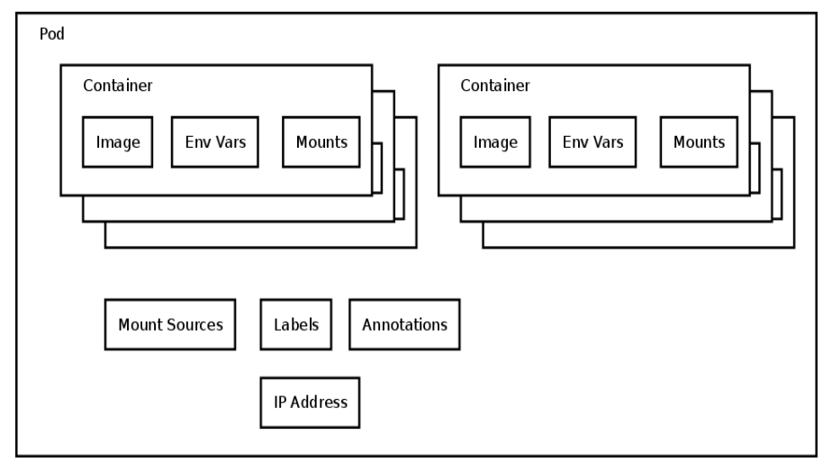
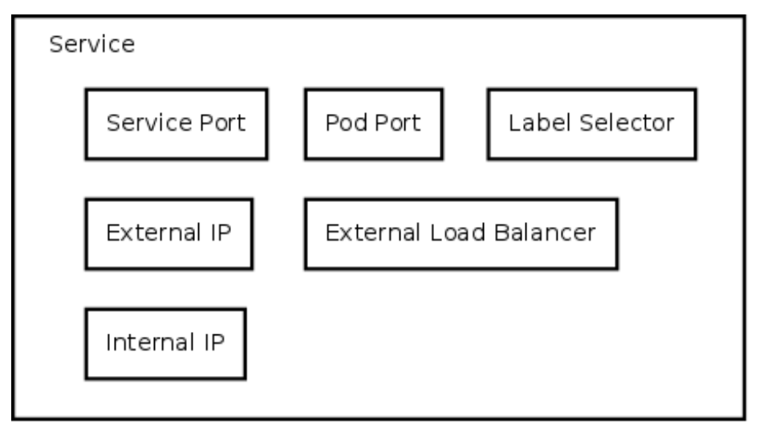

# Azure Kubernetes Services

## Kubernetes

### About Kubernetes
Kubernetes (k8s) is an open-source system for automating deployment, scaling, and management of containerized applications. It groups containers that make up an application into logical units for easy management and discovery.

### Features
1. Start, stop, update, and manage a cluster of machines running containers in a consistent and maintainable way.
2. Particularly suited for horizontally scaleable, stateless, or 'microservices' application architectures.
3. Additional functionality to make containers easier to use in a cluster (reachability and discovery).
4. Kubernetes does NOT and will not expose all of the 'features' of the docker command line.

### Components

1. <b>Master</b>:- It typically consists of  
a) kube-apiserver 
b) kube-scheduler 
c) kube-controller-manager 
d) etcd 
e) kube-proxy 

2. <b>Node</b>:- It typically consists of  
a) kubelet 
b) kube-proxy 
c) cAdvisor 

3. <b>Pods</b>:- 
a) Single schedulable unit of work which neither move nor spans across machines. 
b) Usually one or more container 
c) Metadata about the container(s) 
d) Env vars – configuration for the container 
e) Every pod gets an unique IP by the container engine 

4. <b>Deployment</b>:- 
A Deployment controller provides declarative updates for Pods and ReplicaSets. You describe a desired state in a Deployment object, and the Deployment controller changes the actual state to the desired state at a controlled rate. You can define Deployments to create new ReplicaSets, or to remove existing Deployments and adopt all their resources with new Deployments.

5.  <b>Services</b>:- 

a) How 'stuff' finds pods which could be anywhere 
b) Define:
    <ul>
    <li> What port in the container</li>
    <li> Labels on pods which should respond to this type of request</li>
    </ul>
c) Can define:
    <ul>
    <li> What the 'internal' IP should be</li>
    <li> What the 'external' IP should be</li>
    <li> What port the service should listen on</li>
    </ul>

